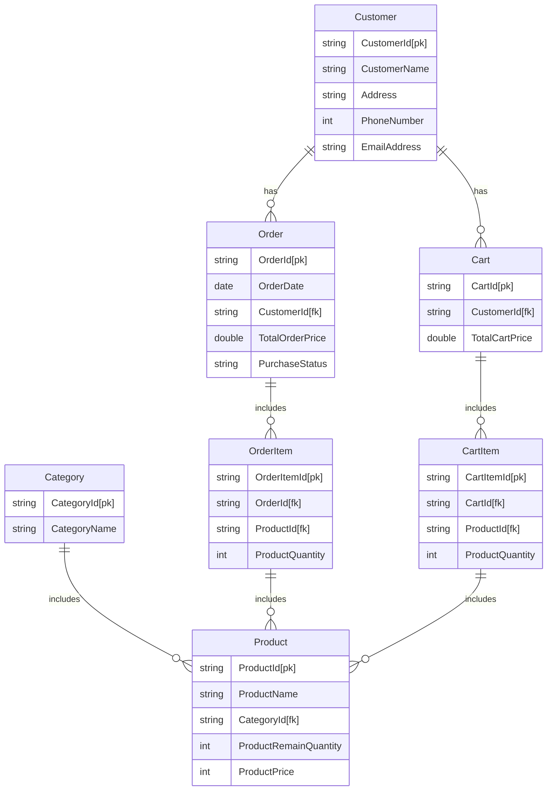

請容我依序回答你的問題：

1.   我沒有使用過任何前端框架，以往我都是直接使用HTML+CSS+Javacript直接設計出網頁。
2.   我剛學習完資料庫語言，沒有使用過任何後端框架。不過我對C++、Python這兩個語言十分熟悉（尤其是C++）。
3.   我有使用過MySQL的經驗。
4.   我沒有部署過伺服器。

請根據我過往的經驗，協助我選擇開發工具。

```mermaid
graph TB
subgraph frontend
		subgraph CustomerData
				CSB[search by] --> CustomerID
				CSB --> CustomerName
				CSB --> Address
				CSB --> 
		end
end
```

我希望網站包含以下三種查詢功能：

1.   查詢顧客資料：
     1.   可以根據CustomerID查詢到顧客，並顯示出該與該顧客有關的所有訂單。
2.   查詢訂單資料：
     1.   可以根據OrderID查詢到訂單，並顯示出該筆訂單所有資料與該顧客所有資料。
3.   查詢庫存資料：
     1.   可以根據PruductID查詢到商品，並顯示出該商品所有資料。