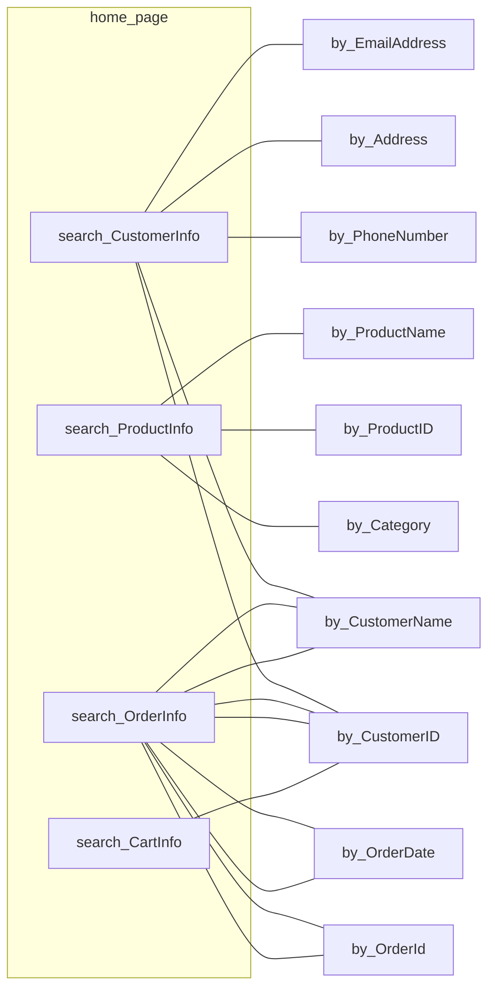

## Web Application Architechture




## Database

###  Tables

```shell
desc CartInfo;
+----------------+---------------+------+-----+---------+-------+
| Field          | Type          | Null | Key | Default | Extra |
+----------------+---------------+------+-----+---------+-------+
| CartId         | varchar(255)  | NO   | PRI | NULL    |       |
| CustomerId     | varchar(255)  | YES  | MUL | NULL    |       |
| TotalCartPrice | decimal(10,2) | YES  |     | NULL    |       |
+----------------+---------------+------+-----+---------+-------+
3 rows in set (0.00 sec)

desc CartItem;
+-----------------+--------------+------+-----+---------+-------+
| Field           | Type         | Null | Key | Default | Extra |
+-----------------+--------------+------+-----+---------+-------+
| CartItemId      | varchar(255) | NO   | PRI | NULL    |       |
| CartId          | varchar(255) | YES  | MUL | NULL    |       |
| ProductId       | varchar(255) | YES  | MUL | NULL    |       |
| ProductQuantity | int          | YES  |     | NULL    |       |
+-----------------+--------------+------+-----+---------+-------+
4 rows in set (0.00 sec)

desc Category;
+--------------+--------------+------+-----+---------+-------+
| Field        | Type         | Null | Key | Default | Extra |
+--------------+--------------+------+-----+---------+-------+
| CategoryId   | varchar(255) | NO   | PRI | NULL    |       |
| CategoryName | varchar(255) | YES  |     | NULL    |       |
+--------------+--------------+------+-----+---------+-------+
2 rows in set (0.00 sec)

desc CustomerInfo;
+--------------+--------------+------+-----+---------+-------+
| Field        | Type         | Null | Key | Default | Extra |
+--------------+--------------+------+-----+---------+-------+
| CustomerId   | varchar(255) | NO   | PRI | NULL    |       |
| CustomerName | varchar(255) | YES  |     | NULL    |       |
| Address      | varchar(255) | YES  |     | NULL    |       |
| PhoneNumber  | varchar(15)  | YES  |     | NULL    |       |
| EmailAddress | varchar(255) | YES  |     | NULL    |       |
+--------------+--------------+------+-----+---------+-------+
5 rows in set (0.00 sec)

desc OrderInfo;
+-----------------+---------------+------+-----+---------+-------+
| Field           | Type          | Null | Key | Default | Extra |
+-----------------+---------------+------+-----+---------+-------+
| OrderId         | varchar(255)  | NO   | PRI | NULL    |       |
| OrderDate       | date          | YES  |     | NULL    |       |
| CustomerId      | varchar(255)  | YES  | MUL | NULL    |       |
| TotalOrderPrice | decimal(10,2) | YES  |     | NULL    |       |
| PurchaseStatus  | varchar(255)  | YES  |     | NULL    |       |
+-----------------+---------------+------+-----+---------+-------+
5 rows in set (0.00 sec)

desc OrderItem;
+-----------------+--------------+------+-----+---------+-------+
| Field           | Type         | Null | Key | Default | Extra |
+-----------------+--------------+------+-----+---------+-------+
| OrderItemId     | varchar(255) | NO   | PRI | NULL    |       |
| OrderId         | varchar(255) | YES  | MUL | NULL    |       |
| ProductId       | varchar(255) | YES  | MUL | NULL    |       |
| ProductQuantity | int          | YES  |     | NULL    |       |
+-----------------+--------------+------+-----+---------+-------+
4 rows in set (0.01 sec)

desc ProductInfo;
+-----------------------+---------------+------+-----+---------+-------+
| Field                 | Type          | Null | Key | Default | Extra |
+-----------------------+---------------+------+-----+---------+-------+
| ProductId             | varchar(255)  | NO   | PRI | NULL    |       |
| ProductName           | varchar(255)  | YES  |     | NULL    |       |
| CategoryId            | varchar(255)  | YES  | MUL | NULL    |       |
| ProductRemainQuantity | int           | YES  |     | NULL    |       |
| ProductPrice          | decimal(10,2) | YES  |     | NULL    |       |
+-----------------------+---------------+------+-----+---------+-------+
5 rows in set (0.01 sec)
```

### Test data

```sql
-- 插入 CustomerInfo 測試資料
INSERT INTO CustomerInfo (CustomerId, CustomerName, Address, PhoneNumber, EmailAddress)
VALUES 
('C001', 'John Doe', '123 Main St, Cityville', '1234567890', 'john.doe@email.com'),
('C002', 'Jane Smith', '456 Oak St, Townsville', '9876543210', 'jane.smith@email.com');

-- 插入 Category 測試資料
INSERT INTO Category (CategoryId, CategoryName)
VALUES 
('Cat001', 'Electronics'),
('Cat002', 'Clothing');

-- 插入 ProductInfo 測試資料
INSERT INTO ProductInfo (ProductId, ProductName, CategoryId, ProductRemainQuantity, ProductPrice)
VALUES 
('P001', 'Smartphone', 'Cat001', 50, 499.99),
('P002', 'Laptop', 'Cat001', 30, 999.99),
('P003', 'T-Shirt', 'Cat002', 100, 19.99),
('P004', 'Jeans', 'Cat002', 80, 39.99);

-- 插入 OrderInfo 測試資料
INSERT INTO OrderInfo (OrderId, OrderDate, CustomerId, TotalOrderPrice, PurchaseStatus)
VALUES 
('O001', '2023-01-15', 'C001', 1499.97, 'Completed'),
('O002', '2023-02-20', 'C002', 239.97, 'Shipped');

-- 插入 OrderItem 測試資料
INSERT INTO OrderItem (OrderItemId, OrderId, ProductId, ProductQuantity)
VALUES 
('OI001', 'O001', 'P001', 2),
('OI002', 'O001', 'P003', 5),
('OI003', 'O002', 'P002', 1),
('OI004', 'O002', 'P004', 3);

-- 插入 CartInfo 測試資料
INSERT INTO CartInfo (CartId, CustomerId, TotalCartPrice)
VALUES 
('CI001', 'C001', 599.98),
('CI002', 'C002', 79.98);

-- 插入 CartItem 測試資料
INSERT INTO CartItem (CartItemId, CartId, ProductId, ProductQuantity)
VALUES 
('CII001', 'CI001', 'P001', 1),
('CII002', 'CI001', 'P003', 3),
('CII003', 'CI002', 'P002', 2),
('CII004', 'CI002', 'P004', 1);
```

以下是我的`search_ProductInfo.html`：

```html
<!DOCTYPE html>
<html lang="en">
<head>
    <meta charset="UTF-8">
    <meta name="viewport" content="width=device-width, initial-scale=1.0">
    <title>Search Customer Info</title>
</head>
<body>
    <h1>Search Customer Info</h1>
    <form action="/search_CustomerInfo" method="POST">
        <label for="by_CustomerID">Search by Customer ID:</label>
        <input type="text" id="by_CustomerID" name="by_CustomerID">
        <label for="by_CustomerName">Search by Customer Name:</label>
        <input type="text" id="by_CustomerName" name="by_CustomerName">
        <label for="by_PhoneNumber">Search by Phone Number:</label>
        <input type="text" id="by_PhoneNumber" name="by_PhoneNumber">
        <label for="by_Address">Search by Address:</label>
        <input type="text" id="by_Address" name="by_Address">
        <label for="by_EmailAddress">Search by Email Address:</label>
        <input type="text" id="by_EmailAddress" name="by_EmailAddress">
        <input type="submit" value="Search">
    </form>
</body>
</html>
```

以下是我的`app.py`：

```python
import mysql.connector
from flask import Flask, render_template, request

# Initialize Flask
app = Flask(
    __name__, 
    static_folder="static", 
    static_url_path="/static"
)

# Database setting
db_config = {
    "host": "uzb4o9e2oe257glt.cbetxkdyhwsb.us-east-1.rds.amazonaws.com",
    "user": "byg9m4pbvaijmv33",
    "password": "u6wbqkhe1bpbzz2j",
    "database": "jw1i5zo4xwn6muaq",
    "port": 3306
}

# Home page
@app.route("/")
def index():
    return render_template("index.html")

# Search customer information
@app.route("/search_CustomerInfo", methods=["GET", "POST"])
def search_customer_info():
    if request.method == "POST":
        # customer attribute
        id = request.form.get("by_CustomerID")
        name = request.form.get("by_CustomerName")
        phone_number = request.form.get("by_PhoneNumber")
        address = request.form.get("by_Address")
        email = request.form.get("by_EmailAddress")

        # query
        connection = None
        try:
            # build database connection
            connection = mysql.connector.connect(**db_config)
            cursor = connection.cursor()
            conditions = []
            values = []

            # select conditions and values
            if id:
                conditions.append("CustomerID LIKE %s")
                values.append(f"{id}")
            if name:
                conditions.append("CustomerName LIKE %s")
                values.append(f"%{name}%")
            if phone_number:
                conditions.append("PhoneNumber LIKE %s")
                values.append(f"%{phone_number}%")
            if address:
                conditions.append("Address LIKE %s")
                values.append(f"%{address}%")
            if email:
                conditions.append("EmailAddress LIKE %s")
                values.append(f"%{email}%")
            
            # build SQL query
            query = "SELECT * FROM CustomerInfo"
            if conditions:
                query += " WHERE " + " AND ".join(conditions)
            cursor.execute(query, tuple(values))
            result = cursor.fetchall()
            cursor.close()
            connection.close()
            return str(result)
        except mysql.connector.Error as err:
            return f"Error: {err}"
        
        finally:
            if connection is not None and connection.is_connected():
                connection.close()
                cursor.close()
            
    return render_template("search_CustomerInfo.html")

# Search product information
@app.route("/search_ProductInfo", methods=["GET", "POST"])
def search_product_info():
    if request.method == "POST":
        # product attribute
        id = request.form.get("by_ProductID")
        name = request.form.get("by_ProductName")
        category = request.form.get("by_Category")

        # query
        connection = None
        try:
            # connect database
            connection = mysql.connector.connect(**db_config)
            cursor = connection.cursor()
            conditions = []
            values = []

            # select conditions and values
            if id:
                conditions.append("ProductID LIKE %s")
                values.append(f"%{id}%")
            if name:
                conditions.append("ProductName LIKE %s")
                values.append(f"%{name}%")
            if category:
                conditions.append("Category LIKE %s")
                values.append(f"%{category}%")

            # build SQL query
            query = "SELECT * FROM ProductInfo"
            if conditions:
                query += " WHERE " + " AND ".join(conditions)
            cursor.execute(query, tuple(values))
            result = cursor.fetchall()
            cursor.close()
            connection.close()
            return str(result)
        except mysql.connector.Error as err:
            return f"Error: {err}"
    return render_template("search_ProductInfo.html")

# Search order information
@app.route("/search_OrderInfo")
def search_order_info():
    return render_template("search_OrderInfo.html")

# Search cart information
@app.route("/search_CartInfo")
def search_cart_info():
    return render_template("search_CartInfo.html")

if __name__ == "__main__":
    app.run(debug=True)
```

目前網頁在部署完成後都可以正常運行，我現在希望對網頁格式進行改進：

1.   在顯示查詢結果時，會跳轉到一個新的分頁。我希望查詢結果直接顯示在原有網頁下方。
2.   在顯示查詢結果時，會將結果直接以字串形式渲染在網頁上。我希望查詢結果可以以一個表格的形式呈現。
